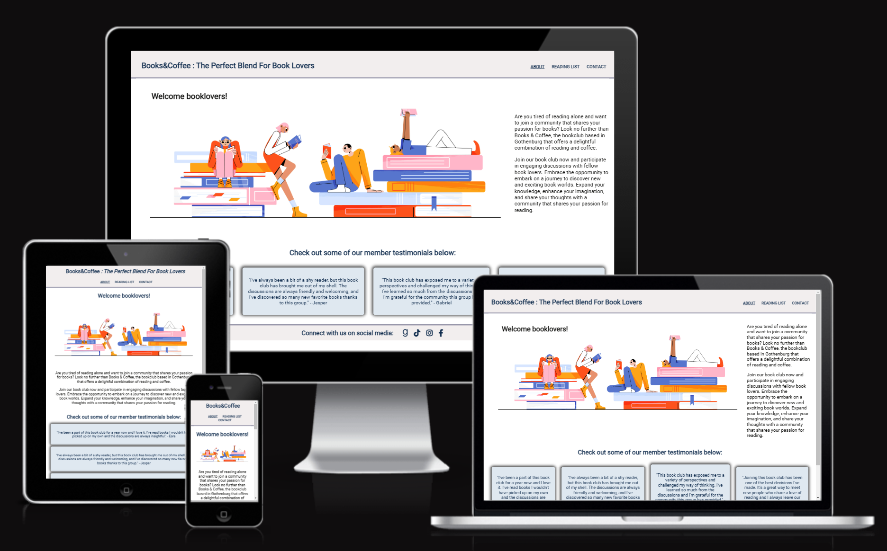
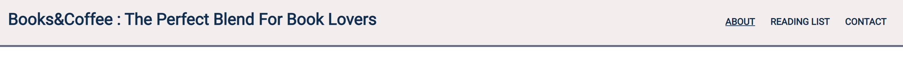
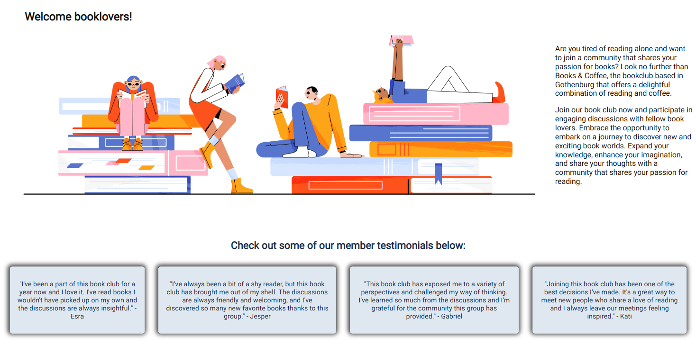
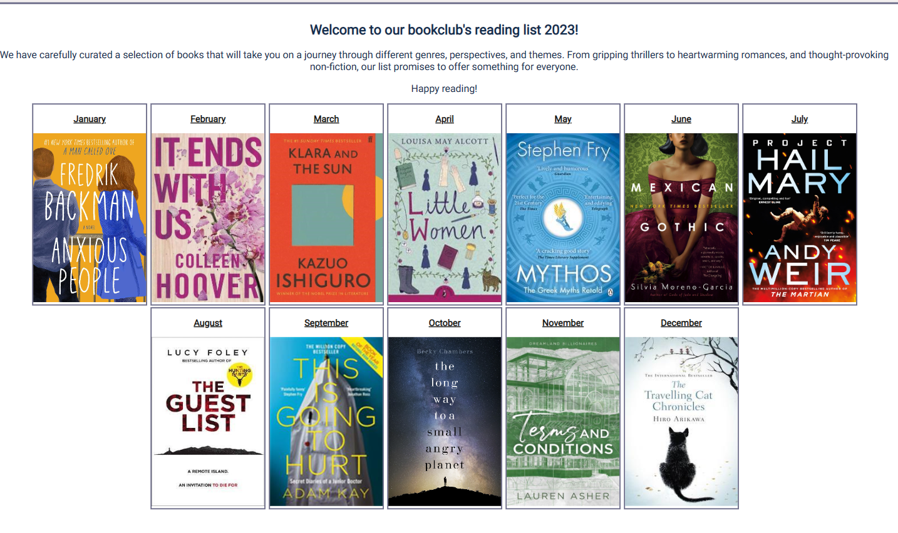
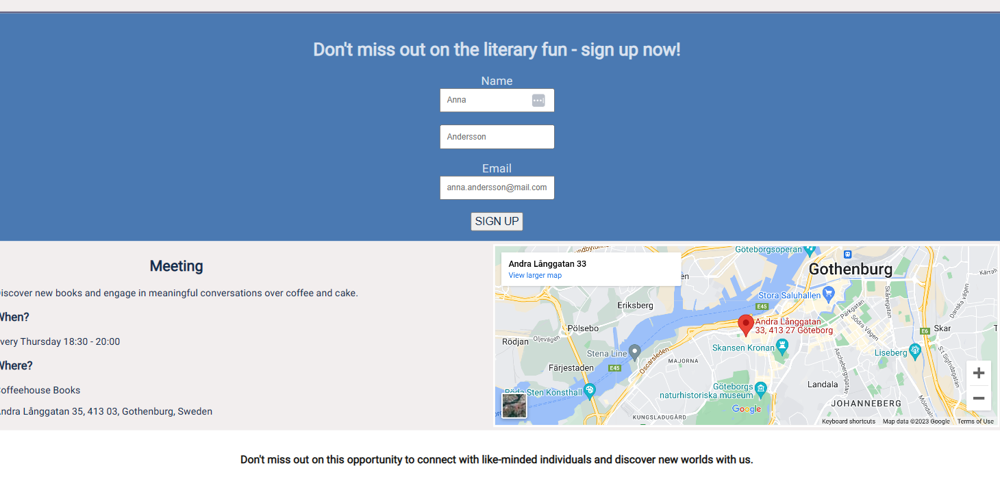
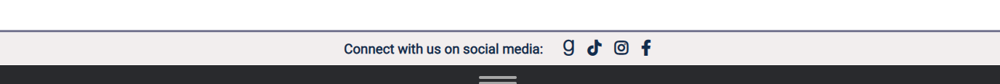
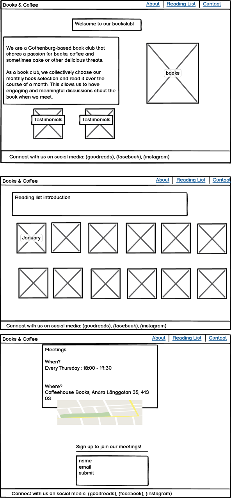
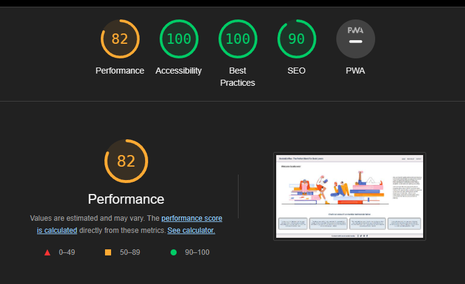
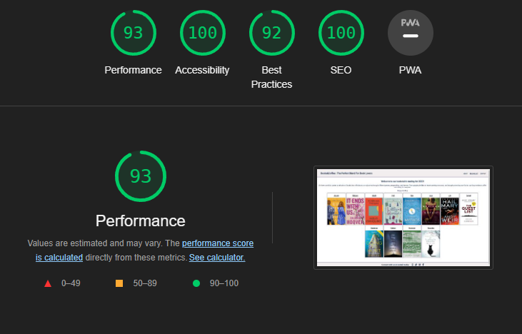
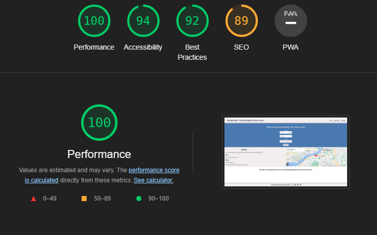

# *Books & Coffee: The Perfect Blend for Book Lovers!*

Books&Coffee is a site for book lovers based in Gothenborg, Sweden. This site is directed to book lovers that want to meet in person and enjoy a cup of coffee and cake. Books&Coffee site has times for weekly meetings and a sign up sheet that makes it easier for book lovers to find likeminded individuals.

## **User stories** ##

* As a user, I can go to meetings and connect with people offline to discuss books.

* As a user, I can see the reading list for the whole year in advance and find inspiration even if i do not sign up. 

* As a user,I can sign up for the meetings and find the location fo the meeting place with Google Maps. 

## **Features** ##

### *Existing features* ###

#### **Header** ####

 * This includes the title of the book club and it is nested on the top left side of the page and the links to the other pages are to the right. 
 * The navigation bar is nested in the header with links to "About", "Reading List" and "Contact" so the user can easily navigate between the pages.
 * The page that the user is currently on is underlined for better user experience.

 

 
 #### **About us** ####

 * The "About" page has a little explanation for the purpose of the book club and testimonials.
 * The "About" page is divided between two sections.
 * The first section contains an illustration of people reading books by Freepik. There is a short    introduction of the book club on the right side of the section for the users to read about the purpose of the book club.
 * The second section contains testimonials from the members of the book club.
 * This section gives users insight to what other members think of the book club. 

 

 ####  **Reading List** ####

 * The "Reading list" page includes a little intro text to wake curiosity for the user. 
 * The "Reading list" has pictures of the books that are chosen for the reading list.
 * This page gives users insight into the books that are chosen and the intended monthly schedule.

 

 #### **Contact** ####

 * Here we have the "Sign up" form to join the club. Under the form are times and places for the meeetings.
 * There is a map that shows the address for the meeting place that users can interact with and open in a new tab to easier find the meeting place. 
 * When users sign up they get a confirmation message "Thank you for signing up!". 

 

 #### **Footer** ####

 * Here we have the social media links for the book club. 
 * The media links have styling with FontAwesome icons. This makes easier for users to connect with the book club on social media. 
 * The links open in a new tab to make it easier for users to connect with the book club on social media without leaving the page. 

 

 
 ### *Future features* ###
 * The reading list page should be rewritten to allow members to choose books every month. It would make for more engaging experience for the user if they can chose the book from a list.
 * Insert a new page where members can sign in and get special updates only for the community.

 ## **Typography** ##
 The font used is "Roboto Light 300" and "Roboto Regular 400".

 
 ## **Technology** ##
 * The web page was constructed using VS code and Gitpod which is a cloud based development environment.
 * The web page was written using HTML and CSS. 
 * The web page uses icons from FontAwesome.
 * The web page was deployed on GitHub.

 ## **Wireframes** ##

 This is the intial idea for the web page.

## **Testing** ##

The page was tested in following browsers: Edge, Chrome, Safari, Firefox. 

### *Code Validation* ####

#### HTML

* No errors were found when the code was tested in official W3C validator.

#### CSS

* No errors were found when the code was tested in official (Jigsaw) validator.

### *Accessibility* ###

The font-family and the colors that were chosen were tested in devtools Lighthouse in Edge to confirm that the colors are accessible and easy to read for all pages. 

About us

Reading list

Contact

### *Fixed bugs* ###

*  When the webpage was deployed in GitHub several images had broken links. This was because the images were deployed to the images folder in format jifi that is not supported by the browser. This was corrected by uploading the images again with the correct format jpg.

* Several images had capital letters when deployed. This was fixed.

* Input [type=text], input [type=email] and input[type=submit] was used in CSS to style the sign up    form. This is not recommended and the CSS style for the sign up form is corrected by using class for the styling.

### **Supported screens** ###

* The web page is responsive and works as espected in Edge, Chrome, Firefox and Safari. 
* The web page is responsive for diffrent viewpoints: desktop, laptop, tablet and mobile.

## **Deployment** ##

* The web page was deployed to GitHub pages using the folowing steps:
    - Go to the GitHub repository and navigate to Settings.
    - On the left side in the Settings klick on the pages tab.
    - Go to bulid and deployment and choose source: Deploy from branch.
    - Under branch choose main for branch and root for folder. 
    - When you press on the save button, your site is being deployed.

The live link can be found here:<a href="https://jasminabihel.github.io/books-and-coffee/index.html.">Books&Coffee</a>

## **Credits** ##
* The image in the "About us" page was taken from Freepik. 
 <a href="https://www.freepik.com/free-vector/book-club-concept-with-people-read-books_29222683.htm#query=book%20illustration%20with%20people&position=4&from_view=search&track=ais">Image by upklyak</a> on Freepik

* The images in the "reading list" page were taken from Goodreads.

* The code for the "social media links" in HTML in the footer was taken from CI "Love Running project".

* The styling in CSS for the testimonials cards comes from W3 schools cards <a href="https://www.w3schools.com/w3css/w3css_cards.asp">w3schools</a>

* The code for the map in HTML was obtained via Google Maps feature "embed a map".
